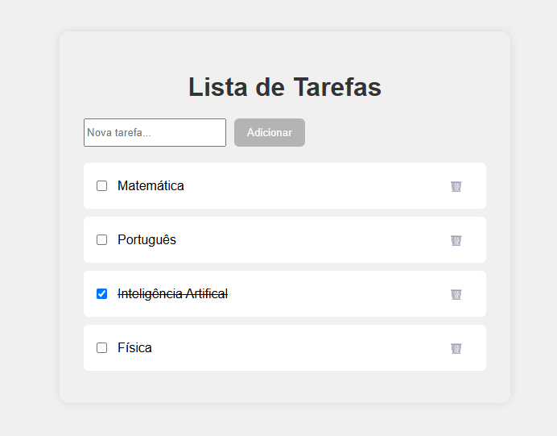

# 📋 Todo List App — Vue.js 3 + .NET 8 Web API

Projeto simples de Lista de Tarefas (Todo List), utilizando:

- 🔸 **Frontend:** Vue.js 3 com @vue/cli
- 🔸 **Backend:** ASP.NET 8 Web API
- 🔸 **API:** Simples, com armazenamento em memória (sem banco de dados)
- 🔸 **Plataforma:** Windows (funciona em Linux/Mac também)


## 🗂️ Estrutura do Projeto

todo-app/
├── backend/       # ASP.NET 8 Web API
└── frontend/      # Vue.js 3 com @vue/cli

## 🚀 Tecnologias Utilizadas

- Vue.js 3 (`@vue/cli`)
- Axios (para requisições HTTP)
- .NET 8 Web API
- C#
- CSS puro (ou Tailwind opcional)
- Node.js

## ⚙️ Pré-requisitos

- [.NET 8 SDK](https://dotnet.microsoft.com/en-us/download/dotnet/8.0)
- [Node.js](https://nodejs.org/)
- [@vue/cli](https://cli.vuejs.org/) (`npm install -g @vue/cli`)


## 🧠 Como Rodar o Projeto

### 🖥️ Backend — .NET 8 Web API

1. Acesse a pasta do backend:

```bash
cd backend
````

2. Execute a API:

```bash
dotnet run
```

3. A API estará disponível em:

* `https://localhost:5001/api/todo`
* `http://localhost:5000/api/todo`

### 🌐 Frontend — Vue.js 3

1. Acesse a pasta do frontend:

```bash
cd frontend
```

2. Instale as dependências:

```bash
npm install
```

3. Execute o servidor de desenvolvimento:

```bash
npm run serve
```

4. Acesse no navegador:

* `http://localhost:8080`

## 🔗 Rotas da API

| Método | Endpoint         | Descrição               |
| ------ | ---------------- | ----------------------- |
| GET    | `/api/todo`      | Listar todas as tarefas |
| POST   | `/api/todo`      | Criar uma nova tarefa   |
| PUT    | `/api/todo/{id}` | Atualizar uma tarefa    |
| DELETE | `/api/todo/{id}` | Deletar uma tarefa      |


## 🎨 Funcionalidades

* ✔️ Adicionar tarefas
* ✔️ Marcar como concluída (checkbox)
* ✔️ Editar status (feito/não feito)
* ✔️ Excluir tarefas
* ✔️ Interface simples, responsiva e agradável


## 📸 Screenshot

 <!-- (adicione um screenshot na raiz do projeto) -->

---

## 🏗️ Melhorias Futuras

* 🔸 Adicionar persistência com banco de dados (SQLite, PostgreSQL ou SQL Server)
* 🔸 Autenticação de usuários
* 🔸 Filtros (Todas, Ativas, Concluídas)
* 🔸 Deploy com Docker
* 🔸 Adicionar testes unitários e de integração


## 👩‍💻 Desenvolvido por

Débora Larissa 💙
🚀 [LinkedIn](https://www.linkedin.com/in/debora-larissa/) | 🌐 [Portfólio](https://www.deboralarissa.com.br/)
